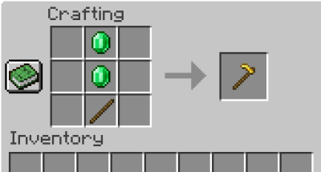

## Item Serializer
```yaml
# me.deecaad.core.file.serializer.ItemSerializer
Item:
  Type: <Material>:<Data>
  Name: <name>
  Lore:
  - <Lore line>
  - <etc.>
  Durability: <durability>
  Unbreakable: <true/false>
  Custom_Model_Data: <custom model data number>
  Hide_Flags: <true/false>
  Enchantments:
  - <Enchantment>-<Level>
  Skull:
    Owning_Player: <UUID of player or name of player>
  Potion:
    Color: <ColorType>
  Attributes:
  - <Attribute>-<Amount>
  Leather_Color: <me.deecaad.core.file.serializer.ColorSerializer>
  Recipe:
    Shape:
      - "012"
      - "345"
      - "678"
    Ingredients:
      '0': <ItemSerializer>
      '1': <ItemSerializer>
```
#### `Type`: \<String\>
This is the material of your item, e.g. `diamond_hoe`. This is not case sensitive. **NEVER USE MAGIC NUMBERS**.
This plugin does not support numerical item ids. Instead of using 294, you **must** use `golden_hoe`.

If you are in legacy versions (minecraft versions 1.8.9 through 1.12.2) then you may have to use extra data.
If you want to use red dye as your item, you should use: `Type: dye:1`.

For material lists for each version, please look [here](#References)

#### `Name`: \<String\>
This is the display name for your item, like renaming your item in an anvil. You can use [color codes](#References).

#### `Lore`: \<String List\>
This is the lore of your item. There can be as many lines as you want. You can use [color codes](#References)

#### `Durability`: \<Integer\> 
How damaged your item is. Make sure you only use this with things that can be damaged (bows, tools, swords, fishing rod).

#### `Unbreakable`: \<Boolean\>
Sets if your weapon is unbreakable by vanilla durability.

#### `Custom_Model_Data`: \<Integer\>
Sets the [custom model data](https://www.planetminecraft.com/forums/communities/texturing/new-1-14-custom-item-models-tuto-578834/)
introduced in minecraft 1.14.

#### `Hide_Flags`: \<Boolean\>
Hides all item flags (Enchantments, Attributes, Unbreakable, Destroys, Placed on, Potion effects, Dye color)

#### `Enchantments`: \<String List\>
Adds enchantments with given levels to the item. The format is `Enchant-Level`. For the complete list of
enchantments, please look [here](#References)

Example:
```yaml
Enchantments:
  - "sharpness-5"
  - "smite-5"
```

#### `Skull.Owning_Player`: \<String\>
Sets the skull data of the skull. Make sure to use `Type: player_skull` with this.

#### `Potion.Color`: \<String\>

#### `Attributes`: \<String List\>

#### `Leather_Color`: \<Color\>
See [color serializer](#Color)

#### `Recipe`: 
This creates a craft recipe for your item so you can craft it in a 
crafting table. You can only make recipes with shapes (So you have to
specify a shape, like an iron sword. You can not have a shapeless recipe,
like a flint and steel).

* `Shape`:
  * This is where you define where your items go.
  * Each item gets a unique character
  * You can have 3 items each line
* `Ingredients`:
  * These are the actual items that you put in the crafting table
  * You can use simple materials or advanced
  * Instead of explaining how to use this, just look at the examples
  
Examples: 

The following creates a recipe like an emerald sword
```yaml
  Recipe:
    Shape:
      - "e"
      - "e"
      - "s"
    Ingredients:
      'e': EMERALD
      's': STICK
```

```yaml
  Recipe:
    Shape:
      - "e e"
      - " # "
      - "e e"
    Ingredients:
      'e':
        Type: "diamond"
        Name: "&eTest"
        Lore:
          - "&7Testing testing 123"
      '#': STICK
```
TODO picture example


## Color
```yaml
Color: <String>
```
There are 3 valid formats for colors: `simple`, `rgb`, and `hex`. (Pick
whichever one you like the most. I prefer `hex`)

Colors using the `simple` format are like the vanilla minecraft chat
colors. Here is the predefined list:
  * `"black"`
  * `"dark_blue"`
  * `"dark_green"`
  * `"dark_aqua"`
  * `"dark_red"`
  * `"dark_purple"`
  * `"gold"`
  * `"gray"`
  * `"dark_gray"`
  * `"blue"`
  * `"green"`
  * `"aqua"`
  * `"red"`
  * `"light_purple"`
  * `"yellow"`
  * `"white"`


To use the `rgb` format, use `red-green-blue`. For example, purple could
look like this: `255-0-255`. Online color calculators should have support
for rgb.

For `hex`, use `#<code>`, where \<code\> is the 6 digit hex. [Online color
calculators] should have support for hex

Examples:
```yaml
Color: "red" # RED
```
```yaml
Color: "255-0-0" # RED 
```
```yaml
Color: "#FF0000" # Red
```

## Trigger
```yaml
  Trigger:
    Main_Hand: <TriggerType>
    Off_Hand: <TriggerType>
    Deny_When:
      Reloading: <true/false>
      Zooming: <true/false>
      Sneaking: <true/false>
      Standing: <true/false>
      Walking: <true/false>
      Swimming: <true/false>
      In_Midair: <true/false>
      Gliding: <true/false>
```
Triggers are actions that are used to call specific methods in code. For example,
in order for shooting to occur there has to be a shoot trigger.

Triggers:
  * `"start_sneak"`
  * `"end_sneak"`
  * `"double_sneak"`
  * `"start_sprint"`
  * `"end_sprint"`
  * `"right_click"`
  * `"left_click"`
  * `"drop_item"`
  * `"jump"`
  * `"double_jump"`
  * `"start_swim"`
  * `"end_swim"`
  * `"start_glide"`
  * `"end_glide"`
  * `"swap_to_main_hand"`
  * `"swap_to_off_hand"`
  * `"start_walk"`
  * `"end_walk"`
  * `"start_in_midair"`
  * `"end_in_midair"`
  * `"start_stand"`
  * `"end_stand"`

#### `Main_Hand`: \<String\>
This is what trigger the plugin will listen for when your gun is in your main
hand. 

Use one of the triggers from the list above.

#### `Off_hand`: \<String\>
This is what trigger the plugin will listen for when your gun is in your off
hand. 

Use one of the triggers from the list above.

#### `Deny_When`:
This is a list of things that can stop the plugin from triggering things. Say you
don't want people to be able to reload guns in water, you can do that here. If any
of these conditions are met, then the trigger does not occur.

  * `Reloading`: If the player is reloading
  * `Zooming`: If the player is scoping
  * `Sneaking`: If the player is sneaking (holding shift)
  * `Standing`: Uh...
  * `Walking`: If the player is moving
  * `Swimming`: If the player is in water
  * `In_Midair`: If the player is not on the ground
  * `Gliding`: If the player is gliding using an elytra
  
